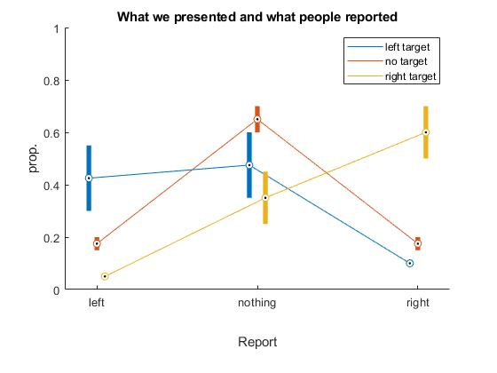
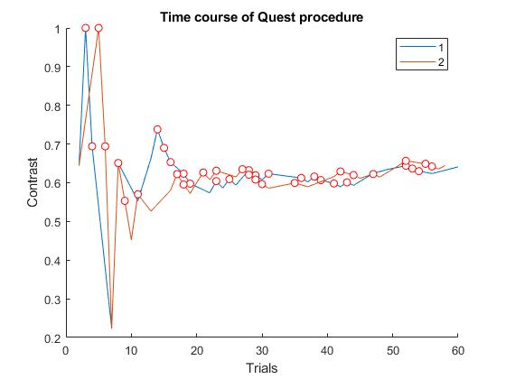

# AlphaSpade
Note: I explain here only things you need to know to get the experiment running. I will detail the rationale of the experiment elsewhere. Nobody said this would be easy, right?

The main file of the experiment is `AlphaSpade.m`. This code should work almost out of the box (provided you have a Psychtoolbox installation). You specify the name of the subject in the variable `name`, which is among the very first lines in `AlphaSpade.m`.

The code is set up so that none of the parameters of the experiment (e.g. stimulus size, color of the background, starting values of the staircase, etc.) are hardcoded in the subfunctions. Instead, all parameters are specified in the function `get_params.m`. This function is basically the "Methods section" of the experiment.

## Summary of the task
This is a spatial detection task. Targets are Gabor-like stimuli; they are not really Gabors because the background is black and only the bright half of the Gabor patch is shown. On each trial, a target can appear at the left or right side or no target at all. The area in which a target may appear is indicated by the circular markers. The task is to say if, and where you saw it. Use the arrow keys as follows:
- left: "I saw it left"
- up: "I saw nothing"
- right: "I saw right"

Target contrast is regulated by a Quest staircase, which will adjust the contrast so that hit rates is approximately 60%.

It is important that subjects are encouraged to make false alarms, or at least are discouraged from being super conservative. My approach is to increase the uncertainty about stimuli so that subjects cannot know for sure if a sensation was due to a faint target or due to noise. To this end,
1. stimuli are presented on a low-contrast, low-luminance background, and
2. targets occur with some spatial uncertainty, i.e. they may appear anywhere within the area delineated by the markers.
But still, it will be important to instruct subjects:
1. don't be too conservative
2. target-absent trials are rare
3. it is important to detect even very faint targets (to not encourage them to be lazy and let Quest increase the contrast)
4. it is OK to make false alarms.

## Logfiles and behavioral results
I store all information about an experiment in a struct called `INFO` with subfields:
- `P` the **p** arameters, i.e. info on stimulus size, duration, screen size etc.
- `T` the **t** rials, i.e. which condition happened on which trial, what was the response etc.
- `Q` the **Q** uest, i.e. parameters and logfile for the staircase procedure.

The `INFO` struct is automatically saved to a file in the Logfiles folder.

You can do a rudimentary analysis (basic data visualization) using the script `analyze_logfiles.m` in the AnalyzeLogfiles directory. This script gives you two images, showing you accuracy and the time course of the QUEST procedure.

## Trigger logic
Although I have not implemented the function for actually sending triggers, I do put together the codes that should be sent as triggers. We want to mark the following events with triggers:
- 10: trial onset;
- 20: stimulus onset;
- 30: onset of the response probe;
- 100 + key: button press.

The numbers indicate the trigger values to which we add the code indicating for this trial where (if any) a target is presented:
- -1: target left;
-  0: no target;
-  1: right target.

Thus, trigger code 19 indicates stimulus onset of a left target; code 9 is onset of a trial on which no target will be presented.

Subjects are to press one of three different button for "I saw left (-1)", "saw nothing (0)" or "saw right (1)". Thus, trigger code 99 indicates that the subject reported "saw left".

Triggers are sent if the parameter `P.isEeg` is set to 1.

## Do not frustrate -- simulate!
For testing the code without requiring a person to watch boring stimuli and press buttons, the experiment can be run at one of three levels of "realness", controlled by the parameter `P.do_testrun`.:
- 0: this is not a drill, show real stimuli and collect real button presses;
- 1: simulation, show real stimuli, but don't wait for button presses. Responses are simulated according to the Quest procedure. Useful for testing stimulus presentation.
- 2: simulation, don't show stimuli and simulate responses. Useful for testing the code, triggers, etc.

## Things you have to adjust on your system
- System-specific performance check for Psychtoolbox.
- M/EEG triggers.
- In `get_params.m`:
  - Include your computer in the list of machines and modify the settings for screen number (i.e. how many monitors are attached), screen size, and the distance from participant to monitor. This is not super critical for testing, but once we collect real data, we need this to get stimulus sizes right.
  - If your screen is calibrated and you use a color lookup table, provide the path to the CLUT.

## Things you may want to adjust
- In the main file: variable `name`; this is the name of the subject and determines filename of the logfile. Use `name = 'test'` if you do not care for a logfile and do not want to be bugged by warnings that such alogfile already exists.
- In `get_params.m`:
  - `P.do_testrun` allows you to simulate an experiment without having a subject.
  - `P.paradigm.n_trials` defines the number of trials in the experiment. Note: the number refers to an entire set of all conditions in the design. For example, if you have three conditions (say, left stimulus, right stimulus, no stimulus) then `n_trials = 10` gives you 10 * 3 trials.
  - `P.trigger.trig_start` and `P.trigger.trig_stop`: maybe unnecessary on your system, but our system is set up to automatically start/stop the EEG recording when it receives these triggers.

## Not yet implemented, ToDo list
- [] function for sending triggers.
- [] PTB performance checks.
- [] eye tracker integration, if necessary.
- [] whatever response device you use.
